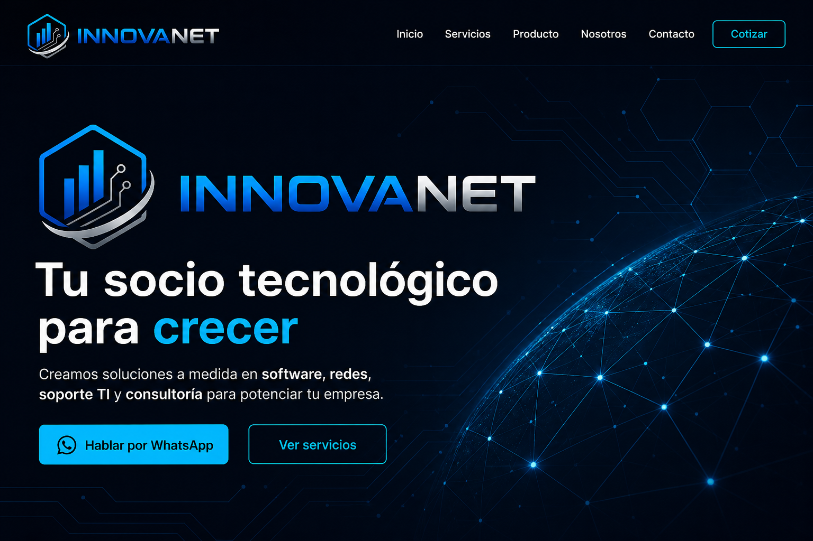
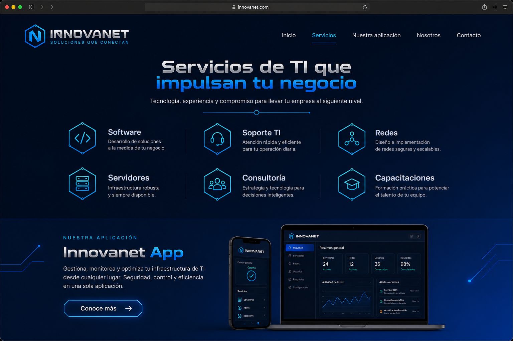
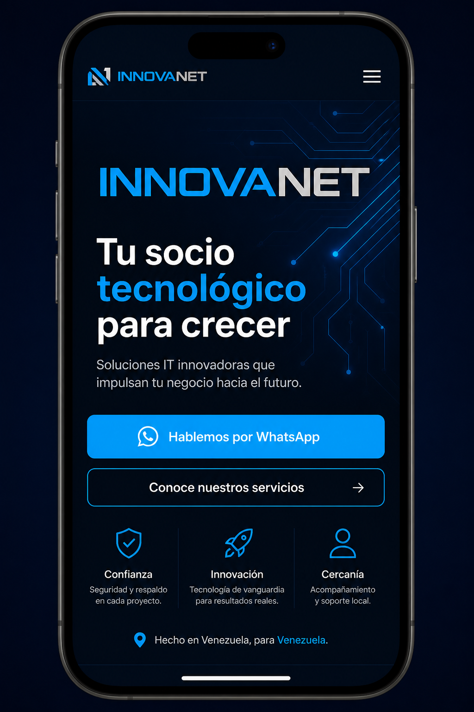
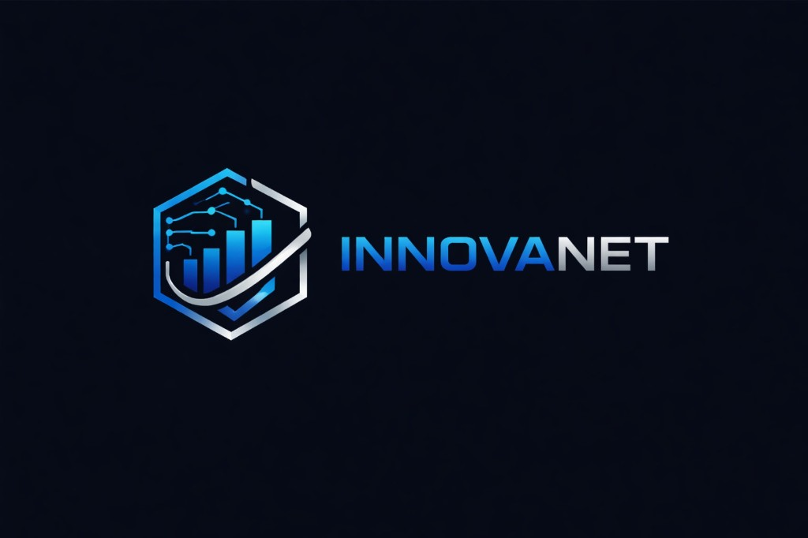

# Diseño visual — Innovanet 2025, C.A.

Propuesta de cómo se vería el sitio (dominio `innovannet`).  
Los mockups están en `docs/mockups/`.

---

## Mockups generados

### 1. Hero (escritorio)



**Qué comunica esta vista:**
- Marca **INNOVANET** como señal principal (logo + nombre)
- Un solo titular + una frase de apoyo
- Dos CTAs: WhatsApp y Ver servicios
- Fondo navy con red/hexágonos sutiles (del ADN del logo)
- Sin tarjetas, sin chips flotantes, sin stats en el primer viewport

---

### 2. Sección Servicios + producto (escritorio)



**Qué comunica esta vista:**
- Catálogo de TI: Software, Soporte, Redes, Servidores, Consultoría, Capacitaciones
- Layout abierto (sin “cards” pesadas)
- Bloque aparte para **tu aplicación** como línea de producto, no como toda la empresa

---

### 3. Móvil



Misma jerarquía: marca → titular → frase → CTA WhatsApp.

---

## Paleta

| Rol | Color | Uso |
|-----|--------|-----|
| Fondo | `#050a15` | Base de página |
| Azul marca | `#0066FF` → `#00AAFF` | CTAs, acentos, “INNOVA” |
| Plata | `#C8CDD4` | “NET”, bordes, textos secundarios |
| Texto | `#F2F5FA` | Titulares y cuerpo |
| Superficie suave | `#0B1220` | Secciones alternas |

---

## Tipografía propuesta

- **Display / marca:** Outfit o Space Grotesk (bold)
- **Cuerpo:** Manrope (regular / medium)
- Evitar Inter, Roboto o Arial como tipografía principal

---

## Wireframe completo (flujo de scroll)

```
┌──────────────────────────────────────────────────────────┐
│  [LOGO INNOVANET]   Inicio  Servicios  Producto  Contacto│
│                                          [ Cotizar ]     │
├──────────────────────────────────────────────────────────┤
│                                                          │
│              HERO (pantalla completa)                    │
│                                                          │
│         INNOVANET  (logo grande / marca)                 │
│         “Tu socio tecnológico para crecer”               │
│         Software · redes · soporte · consultoría         │
│                                                          │
│         [ Hablar por WhatsApp ]  [ Ver servicios ]       │
│                                                          │
│         ··· patrón red / hexágono sutil ···              │
└──────────────────────────────────────────────────────────┘
┌──────────────────────────────────────────────────────────┐
│  SERVICIOS                                               │
│  Una frase de apoyo                                      │
│                                                          │
│   ○ Software     ○ Soporte TI     ○ Redes                │
│   ○ Servidores   ○ Consultoría    ○ Capacitaciones       │
└──────────────────────────────────────────────────────────┘
┌──────────────────────────────────────────────────────────┐
│  PRODUCTO (tu aplicación)                                │
│  Nombre + 1 beneficio + CTA “Conocer app”                │
└──────────────────────────────────────────────────────────┘
┌──────────────────────────────────────────────────────────┐
│  CÓMO TRABAJAMOS                                         │
│  1 Diagnóstico → 2 Propuesta → 3 Implementación → 4 Soporte│
└──────────────────────────────────────────────────────────┘
┌──────────────────────────────────────────────────────────┐
│  CTA FINAL                                               │
│  “Hablemos de tu próximo proyecto”                       │
│  [ WhatsApp ]  [ Formulario / Contacto ]                 │
└──────────────────────────────────────────────────────────┘
┌──────────────────────────────────────────────────────────┐
│  Footer: logo · servicios · contacto · © Innovanet 2025  │
└──────────────────────────────────────────────────────────┘
```

---

## Páginas previstas (fase 1)

| Página | Rol |
|--------|-----|
| `/` Inicio | Hero + servicios + producto + CTA |
| `/servicios` | Detalle de cada pilar de TI |
| `/producto` | Landing de tu aplicación |
| `/nosotros` | Empresa y enfoque |
| `/contacto` | Formulario + WhatsApp + datos |

---

## Notas de marca

- Razón social: **Innovanet 2025, C.A.**
- Nombre visible en UI: **INNOVANET** (como el logo)
- Dominio: `innovannet` (no afecta la marca en pantalla)

---

## Logo de referencia



---

*Documento de propuesta visual — sujeto a ajustes de copy y contenido real (WhatsApp, nombre de la app, textos de servicios).*
